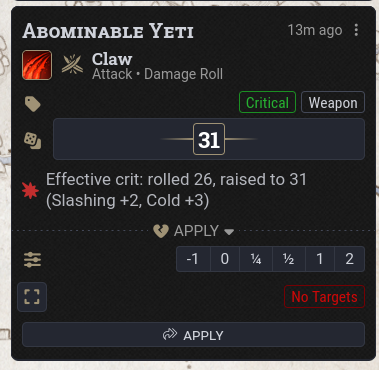
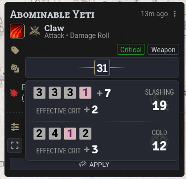

# Effective Critical Hits (dnd5e)

A small Foundry VTT module that makes critical hits a little more reliable.

Critical hits are still rolled normally. If the total damage is lower than the maximum damage the attack could have dealt on a normal hit, a bonus is applied to the damage roll equal to that difference. 

For example:

**Greatsword:** 2d6 + 4  
**Critical Hit:** 4d6 + 4  

The maximum damage of a normal hit is 16, so a critical hit that rolls less than 16 will be raised to 16.

Requires FoundryVTT v14 and dnd5e 6.0 or later.

## Install

### Manifest URL

1. From Foundry's **Setup** screen, open **Add-on Modules**.
2. Click **Install Module**.
3. Paste the module's manifest URL into the **Manifest URL** field:

   `https://github.com/BubbleMoth/Effective-Critical-Hits/releases/latest/download/module.json`

4. Click **Install**.
5. Launch your world and go to **Game Settings → Manage Modules**.
6. Enable **Effective Critical Hits**.

### Manual Installation

You can also download and unzip the module into your Foundry Data folder so that you have:

`Data/modules/effective-crits/module.json`

Restart Foundry, launch your world, and enable **Effective Critical Hits** under **Game Settings → Manage Modules**.
## Behavior

 

- The minimum damage is based on the total damage of the attack, including attacks with multiple damage types.

  For example, a Flame Tongue's slashing and fire damage are both included when checking the minimum.

- If the total damage is too low, the module checks each damage part in order and adds what is needed. A damage part will not be increased above its normal maximum.

- Damage types are kept separate, so resistance and immunity still work normally.

- Extra dice that only happen on a critical hit, such as Savage Attacks, Brutal Strike, or extra critical damage from an item, are still rolled but do not increase the minimum damage.

- Situational bonuses entered into the damage dialog do count toward the minimum.

- If damage is increased, the chat card shows a short message such as:

  `Rolled 28, raised to 31`

  If the attack has multiple damage types, the message will also show which damage type received the extra damage.

- The roll breakdown shows the added damage as a separate `Effective Crit +N` entry.

- The damage tray uses the increased damage value.

## Settings

The module currently has two world settings:

- **Enable Effective Critical Hits**
- **Show note on damage cards**

## Compatibility and Known Limitations

- If **libWrapper** is installed, Effective Critical Hits will use it. The module also works without libWrapper.

- The module checks that the parts of the dnd5e system it relies on still exist. If a future system update changes them, Effective Critical Hits will disable itself and warn the GM instead of interfering with normal damage rolls.

- Effective Critical Hits works with damage rolled through the normal dnd5e damage workflow, including attacks, the damage dialog, and fast-forwarded rolls.

- Modules that replace the normal damage workflow, such as Midi-QOL or Ready Set Roll, have not been tested and may use normal critical hit damage instead.

- Extra damage is added to whichever damage type needs it. The module does not check the target's resistances or immunities before doing this. If that damage type is resisted or ignored, the added damage will be affected too.

- Normal-hit maximums work as expected for normal formulas using dice and addition or subtraction.

  For example:

  `2d6 - 1d4` has a maximum of `11`.

  More complicated formulas, such as ones using multiplication or functions, fall back to maximizing all of the dice.
